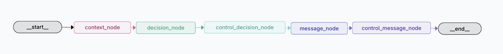

# followup-agent



Human-in-the-loop CLI that generates timing/tone recommendations and drafts
follow-up messages for overdue invoices. Decision logic is deterministic and
auditable; the LLM is only used for wording.

## Quickstart

1) Prepare a CSV/XLSX with required columns:
`client_name`, `invoice_id`, `invoice_amount`, `invoice_issue_date`,
`days_overdue`, `relationship_tag` (plus optional `currency`,
`last_followup_date`, `notes`).

2) Run (dry-run skips LLM message drafting):

```
python -m src.main data/samples/invoices_sample.csv \
  --output outputs/report.md \
  --dry-run
```

3) For message drafts, set `OPENAI_API_KEY` and omit `--dry-run`.

## Output

Generates a Markdown report with one recommendation per invoice, including
timing, tone, and an explanation of the applied rules.
